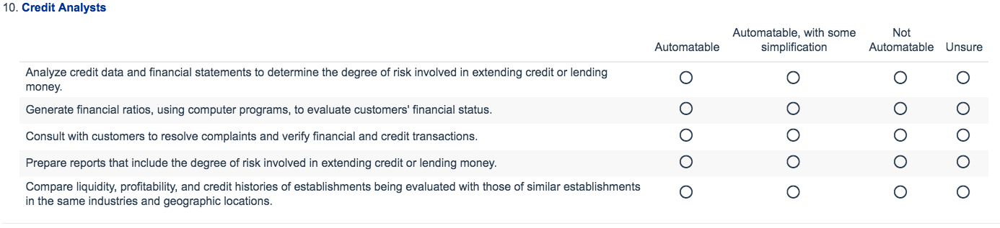

# Methodology

### The Survey

To obtain data on occupation automatability, we crafted and distributed a ten question online survey. The survey consisted of two parts: a brief personal information component, and a main component in which respondents were asked to rate the automatability of five tasks for ten occupations.

The survey first asked each individual for basic demographic and experience information. This included their age range, as well as the position, field, and length of their first most relevant academic and/or industry experience. The section is pictured below:

XX% of respondents opted to provide us their email address.

Each respondent was then allocated a set of ten questions chosen randomly from a master set of thirty. Each question reflected one occupation chosen from 30 selected occupations from our original training set of 70. Each question asked the respondent to rate the automatability of the five most important tasks for that occupation, as ranked by the 2015 O*NET task data. Respondents could choose from four options: "Automatable", "Automatable, with some simplification", "Not Automatable", and "Unsure". While we let the respondents interpret the answers themselves, we gave them two examples of "Automatable" and "Automatable, with some simplification" choices to help guide their responses. A full list of the occupations and their tasks are available in the appendix. An example question is below.

### Survey Distribution

**Note** – This section will substantially change once we have actual responses. This is a placeholder.

We distributed the survey by email, through major academic and professional mailing lists in relevant areas. Each mailing list was selected to be composed of either academics or industry professionals who study, implement, or work with technology or automation processes. Each mailing list was referred to us or judged by us to be high quality: composed mainly of those practicing in the area, and often world leading experts in each.

Mailing lists had targeted subjects: Artificial Intelligence, Machine Learning, Robotics, Computer Vision, Labour Economics, and Growth Economics. Once obtained, we emailed the list with the link to the survey, asking for list members' participation. A sample outreach email is in the appendix. A description of the lists we received responses from is below.

Respondents then elected to participate or not.

| Name | Description | Size | Respondents |
|---|---|---|---|
|   |   |   |   |
|   |   |   |   |
|   |   |   |   |

The outbound nature of this survey has a few shortcomings. First, for some mailing lists we were unable to obtain concrete numbers for the size of the mailing list. Therefore, we cannot identify the exact response rate for each mailing list. Second, we cannot control nor precisely identify who responds. However, because of the experiential and demographic information, we can judge the quality and diversity of the group. Indeed, we see from our responses that we have a well-rounded group of respondents and we are confident in the quality of the group.

